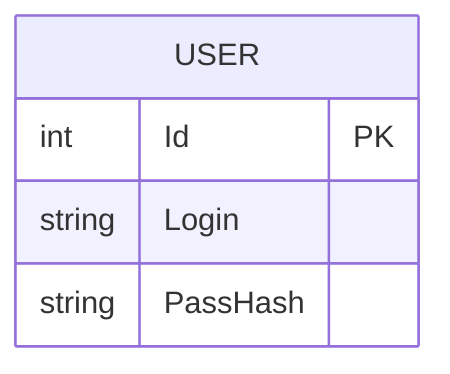

# Lab2 — Часть 3. REST API

CRUD-сервис над таблицей User(Id, Login, PassHash).

## Стек
- ASP.NET Core Web API (.NET 8)
- Entity Framework Core + SQLite
- BCrypt для хеширования паролей

## Эндпоинты
| Метод | URL | Описание |
|-------|-----|----------|
| POST | /user | Создать пользователя |
| GET | /user/{id} | Получить пользователя |
| PUT | /user/{id} | Обновить |
| DELETE | /user/{id} | Удалить |

## Пример запроса
```http
POST /user
Content-Type: application/json

{ "Login": "example_user", "PassHash": "secret" }
```

### ER-диаграмма


## Запуск
```bash
dotnet restore
dotnet run
```
